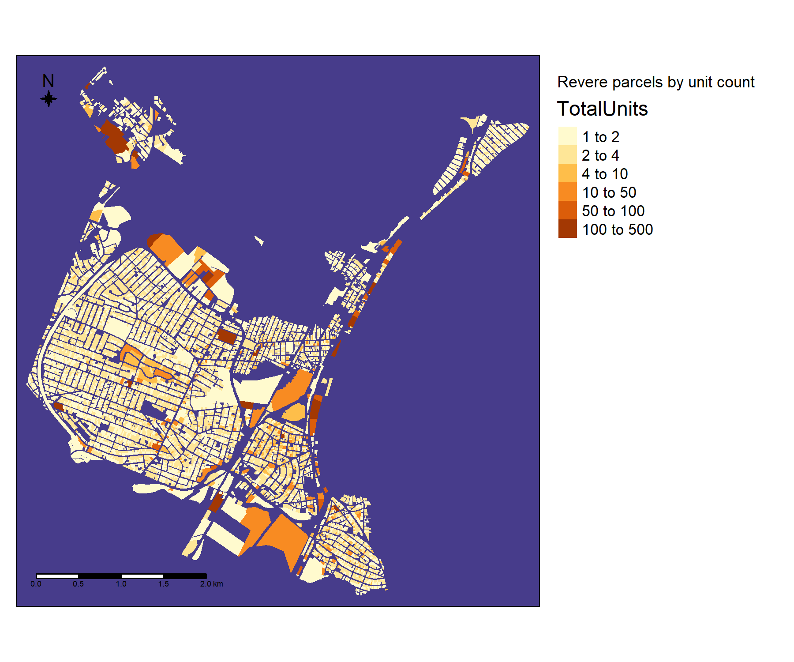
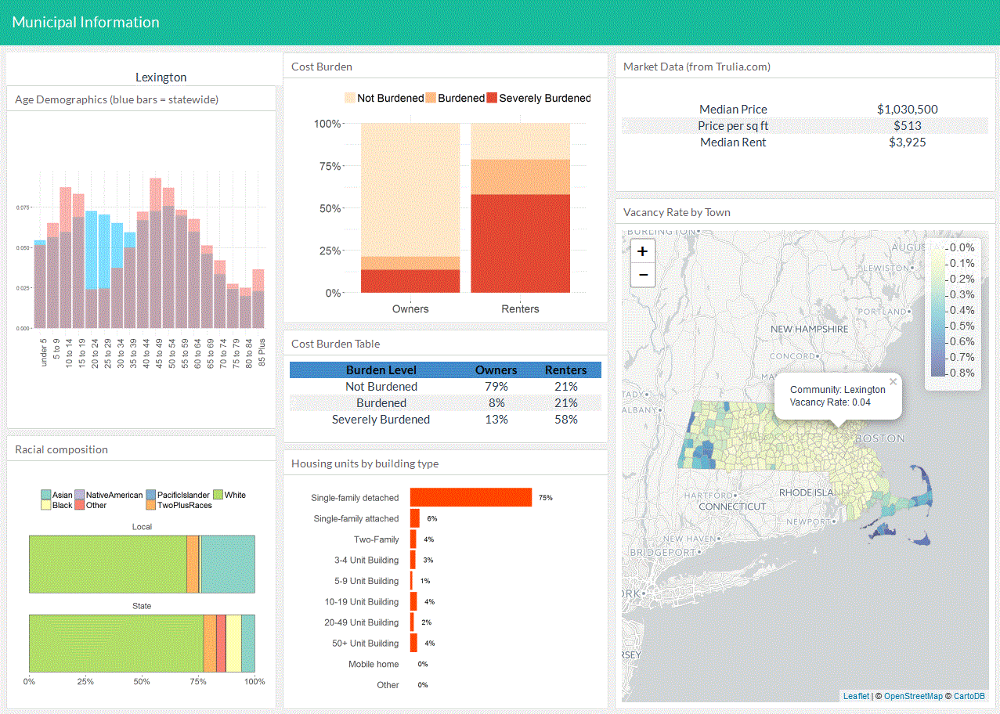
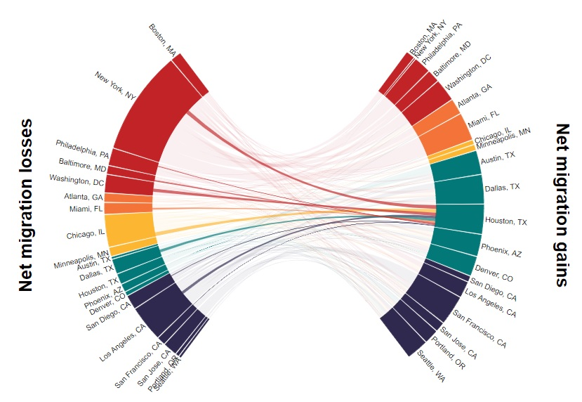
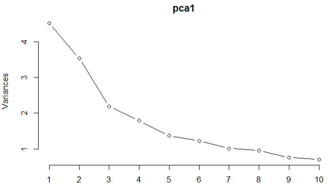

# Bio
Just a data scientist working in the housing policy world. I am the Director of Research & Analytics at the Massachusetts Housing Partnership (MHP), a quasi-public affordable housing agency. In that role, I oversee the public policy research and analysis that drives MHP's Center for Housing Data. I received a BA in Economics and an MA in City Planning from Boston University, and an MS in Urban Informatics from Northeastern University.

While most of my work is focused on housing policy, my interests lie in connecting housing issues with other important urban systems such as transit and the environment. Cities and regions are incredibly complex and interconnected, and I believe we can't understand one component unless we know how it relates to the entire urban fabric. I strive to combine this comprehensive approach to public policy with data science in order to better evaluate critical topics such as diversity, equity and power in the way cities and regions are organized. 

Check out some work samples from my portfolio below, as well as some of the work I've done at MHP's Center for Housing Data.

# [CV](/pdf/Tom Hopper CV.pdf)

# Portfolio
---
## Personal projects 

### [Station Area Analysis in MA](https://github.com/DataHopper/TOD-parcels)
Using tax parcel data from local assessors' databases (compiled, partially standardized, and made available by MassGIS), I fully standardized parcels within one-quarter mile of commuter rail stations in Massachusetts. This required imputing units counts when unavailable using various statistical methods (details available on project page). Results showed significant variation in residential density within station areas across the commuter rail system, indicating that some communities are embracing transit-oriented neighborhood development more than others. 

---
### [Revere, MA Tax Parcel Analysis](https://github.com/DataHopper/revere-parcels)
This project represents further exploration into the tax assessors' parcel database provided through MassGIS. Parcels in Revere, MA were standardized, grouped and explored in order to better understand the city's land use patterns, real estate values, and potential areas of policy concern. 

---
### [Massachusetts Municipal Demographic and Housing Dashboards](https://github.com/DataHopper/community-profiles)
A fully automated tool that relies on data retrieval through the census API as well as data scraped from the Trulia website. This project was an experiment in automating data retrieval, tidying, and visualization for municipal level data. Generation of dashboards is achieved through the use of the flexdashboard package in R. This original exploratory work became the starting point for MHP Center for Housing Data's Shiny app development of the DataTown website.

---

### [Metro-to-metro migration and housing production Shiny app](https://datahopper.shinyapps.io/migrationapp_-_competitors/)
A Shiny app designed to explore the relationship between housing production and net domestic migration among thriving metro areas across the U.S. The app uses plotly to provide interactivity and features a "migration wheel," a custom visualization I designed to allow users to explore the net flow of residents from one city to another.

---

### [Machine learning to predict future gentrification](https://github.com/DataHopper/predicting-gentrification)
Using machine learning and modeling techniques, this project used census-based proxies for gentrification and neighborhood change for the periods 1990-2000 and 2000-2010 in order to construct a predictive model for which census tracts are likely to experience gentrification from 2010-2020. Logit regression, support vector machine and random forest techniwues were combined to create an ensemble model that achieved some level of predictive power (although not particularly strong). Gentrification is an extremely difficult phenomenon to measure, let alone predict, and this research succeeds in demonstrating the nebulous nature of applying conventional analytical methods to the topic.

   

# Blog articles and presentations
#### [Blog - So just how many homes did Waltham allow while gaining 11,000 jobs?](https://www.mhp.net/news/2018/mhp-data-special-so-just-how-many-homes-did-waltham-built-while-adding-11-000-jobs)
  
#### [Presentation - The link between housing supply and transportation in Greater Boston](https://www.mhp.net/writable/resources/documents/City_Awake_Housing_transpo.pdf)
In my role at MHP's Center for Housing Data, presented with co-director Callie Clark and spoke on a panel at the Greater Boston Chamber of Commerce's "Our Convention," a day-long convention aimed at young professionals that focuses on policy issues, November 2018.
  
#### [Presentation - Using Data to Shape Local Conversations](https://www.mhp.net/writable/resources/documents/CHD-40B-presentation_5-4-18_final.pdf)
In my role at MHP's Center for Housing Data, presented with co-director Callie Clark at Citizen's Housing and Planning Association's (CHAPA) Chapter 40B conference in May 2018.

   
# MHP Center for Housing Data projects and publications

### [DataTown](www.mhp.net/datatown/)

DataTown is an interactive site that gathers information on the municipal level for all 351 cities and towns in Massachusetts. Our team compiles and tidies data from sources such as the U.S. Census Bureau, The MA Department of Education and the MA Division of Local Services, among others, and allows users to quickly access and explore this data through a series of simple visualizations. Data is accompanied with coaching text to help users interpret the data, and all data and visualizations can be downloaded with a single click. Grab a chart and pop it into a presentation, share on social media, or post in your blog to get a conversation going about housing and demographic needs in your community!
  
DataTown is a team effort at MHP's Center for Housing Data for all maintenance and updates. I constructed the initial site in Shiny and wrote much of the copy on the site. Check out the project page on MHP Center for Housing Data's team page
  
------
 
### [Greater Boston Housing Report Card - The Boston Foundation](https://www.tbf.org/news-and-insights/reports/2019/june/greater-boston-housing-report-card-2019)

My organization, the Massachusetts Housing Partnership, was part of a research team that created the 2019 Greater Boston Housing Report Card. Our team worked alongside Northeastern University's Dukakis Center and the UMass Donahue Institute to create a fresh new look for this year's publication. The Report Card series has long been an important part of the housing policy dialogue in Massachusetts, and we were incredibly privileged to become part of this legacy. As one of the lead researchers on the team, I created most of the data visualizations across the report, authored much of the 'Core Metrics' section, and designed the methodology, conducted the analysis, and created the data visualizations for the 'Municipal Assessments,' an attempt to score every municipality in Massachusetts on a common set of metrics.
  

